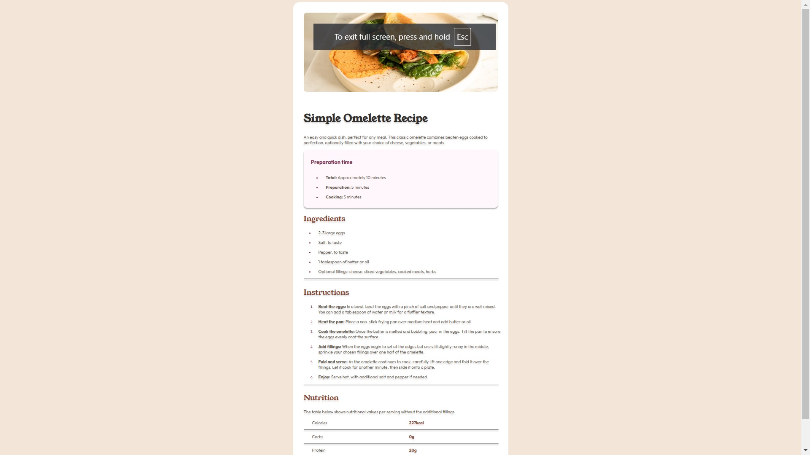

# Frontend Mentor - Recipe page solution

This is a solution to the [Recipe page challenge on Frontend Mentor](https://www.frontendmentor.io/challenges/recipe-page-KiTsR8QQKm). Frontend Mentor challenges help you improve your coding skills by building realistic projects. 

## Table of contents

- [Overview](#overview)
  - [The challenge](#the-challenge)
  - [Screenshot](#screenshot)
  - [Links](#links)
- [My process](#my-process)
  - [Built with](#built-with)
  - [What I learned](#what-i-learned)
- [Author](#author)

**Note: Delete this note and update the table of contents based on what sections you keep.**

## Overview

### Screenshot

### What are you most proud of, and what would you do differently next time?
I am proud of the amount of time it took me to complete. I could draw back on my experience and push out an acceptable version of the desktop site in only a few hours of work without any sophisticated dev tools.

This was also my first time using CSS variables, making my code much easier to understand.

### What challenges did you encounter, and how did you overcome them?
I had to pivot from using a <table> element for the last section to get the horizontal lines. I took a lot of time trying to make it work, then moved on to using 
 elements which worked well.

## #What specific areas of your project would you like help with?
I'd love to hear if other developers had used different HTML tasks. Other than that, the project was fairly straightforward for me.

### Links

- Solution URL: [Here](https://www.frontendmentor.io/solutions/responsive-htmlcss-page-3K6T0d4VyZ)
- Live Site URL: [Live site URL here](https://fementor-recipe-page-rho.vercel.app/)

## My process

### Built with

- Semantic HTML5 markup
- CSS custom properties
- Flexbox
- CSS variable

### What I learned

I took this static webpage challenge to work on using Figma in a dev-friendly way. Using Auto-layout was a game-changer in my process. I also took the time to create CSS variables which made my CSS easier to read as I worked. 

If you want more help with writing markdown, we'd recommend checking out [The Markdown Guide](https://www.markdownguide.org/) to learn more.

## Author

- Website - [LinkedIn](https://linkedin.com/in/tremaine-mckinley/)
- Frontend Mentor - [@yourusername](https://www.frontendmentor.io/profile/tremckinley)
- GitHub - [Find me here](https://github.com/Tremckinley)

## THANK YOU!
